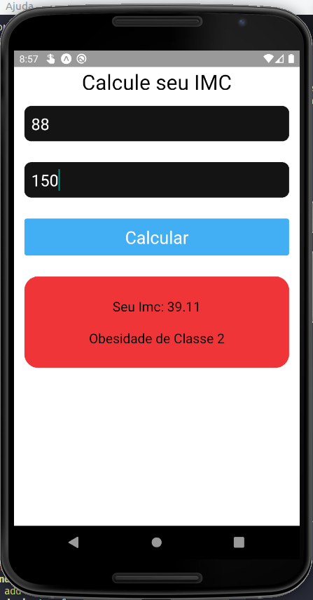
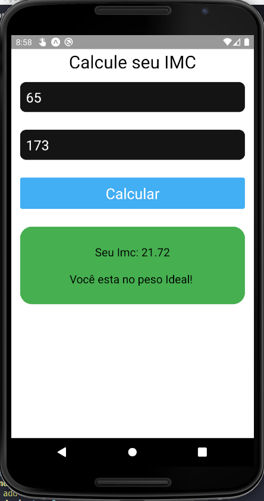
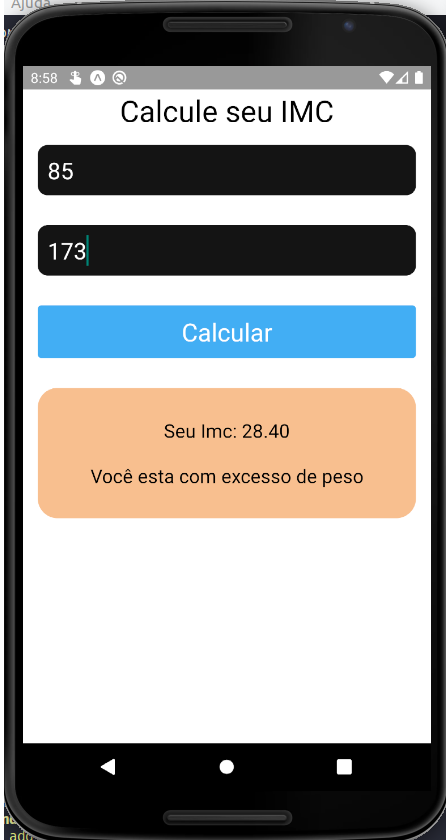
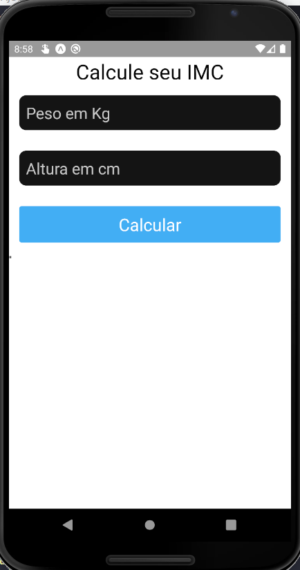

## Calculadora IMC

<p>Aplicação desenvolvida com React-Native, para testes com expo</p>
<p>Aplicação simples, uma calculadora de massa corporal, IMC</p>
>Imagens abaixo








#### Para executar essa aplicação siga os passos:

>Tenha o React-Native, NodeJs, Expo.IO instalados na sua maquina
>Faça um Fork/Clone do repositorio
>Abra o repositorio no terminal, e execute o comando

```js

expo start

```

>Esse app foi testado em emulador ANDROID, então pode apresentar erros usando em smartphones da Apple!


#### Desenvolvido por:

Fernando Santos

<a href="https://www.linkedin.com/in/fernando-santos-686632122/">Linkedin</a>